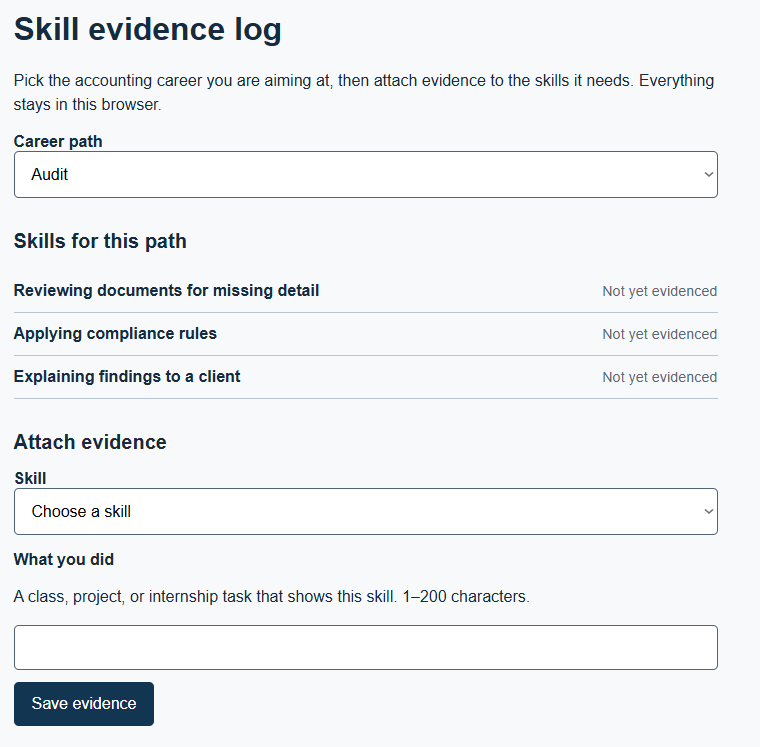
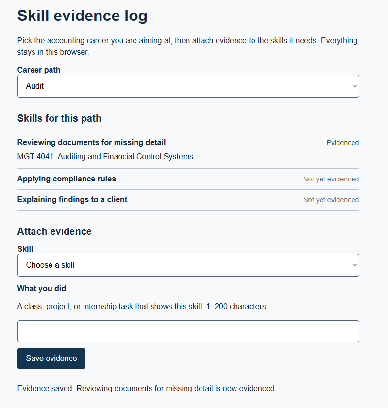
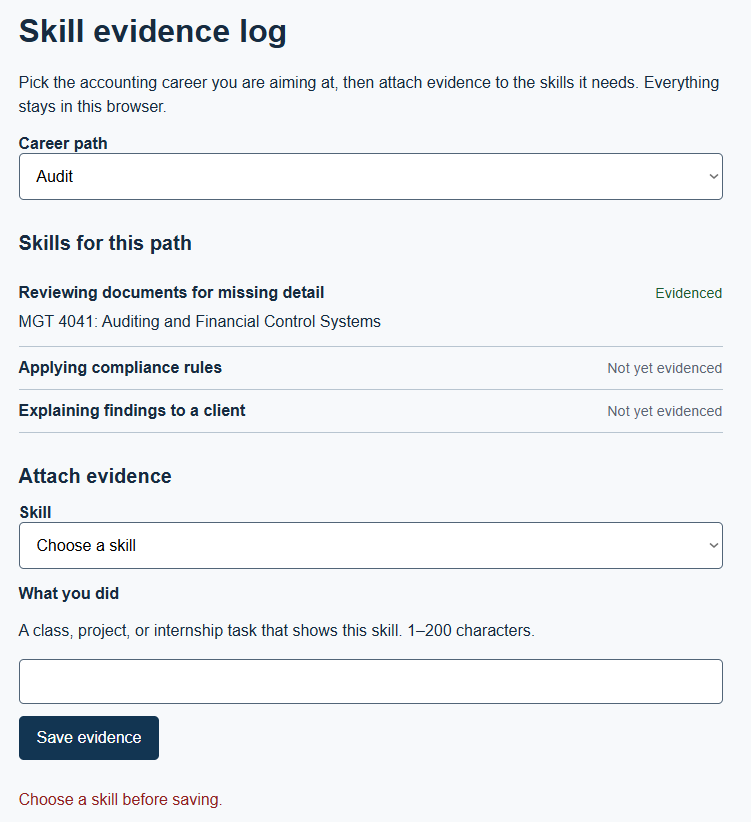
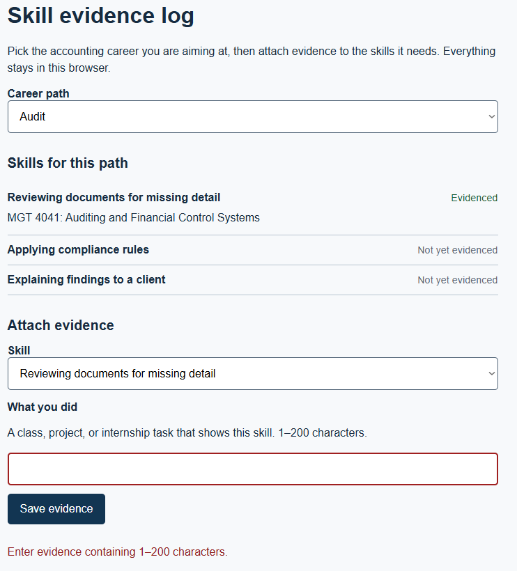
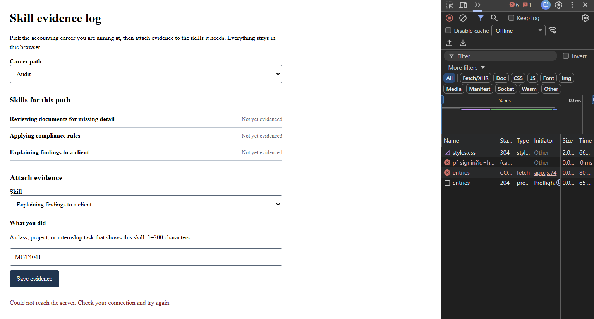
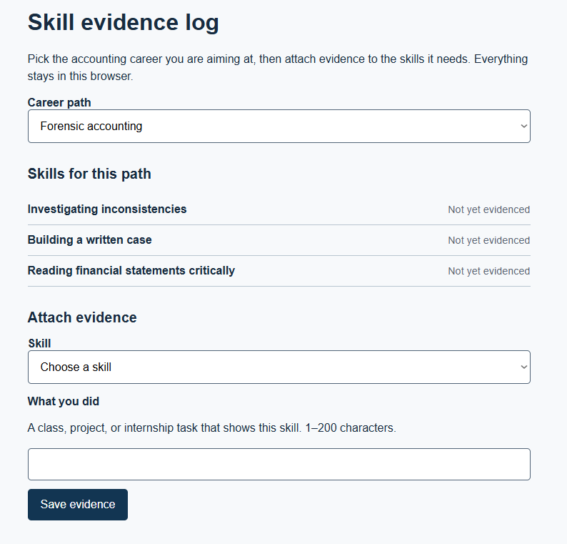
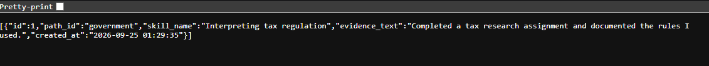
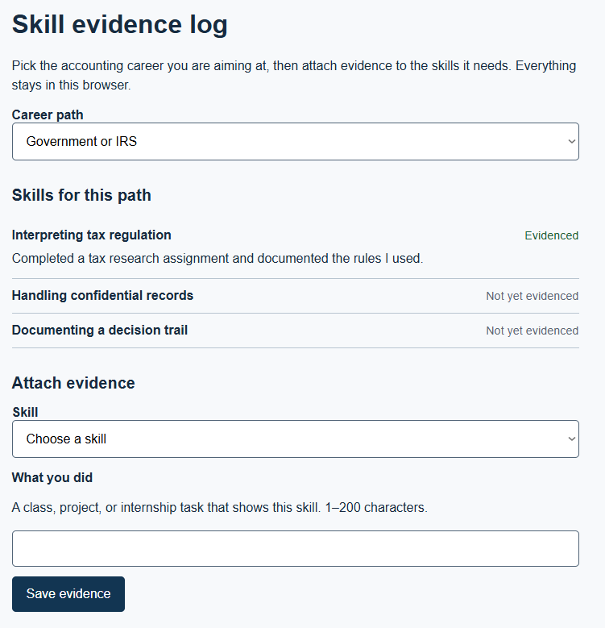

# EVALS.md

The verification table from HW3, grown up. Five sections, in this order.

The first two are written and committed BEFORE any tool sees the spec.

## 1. RAT statement

The riskiest assumption in delegating F-06 is that bolt.new can add an exportable skill summary without breaking the existing evidence-log behavior or bypassing the current application structure.

## 2. Prediction Stake (before build, 2026-10-01 17:10 EST)

<!-- At least one of each. Never edit the prediction text; add resolutions below it. -->

- **Tight:** At least 3 of 4 EARS rows will pass on the tool's first output.

  - Resolved <date>: _ of 4.

- **Loose:** bolt.new will follow STYLE.md tokens better than AI Studio.

  - Resolved <date>: ...

- **Open:** The tool will introduce a dependency I did not ask for. Resolves when I read package.json.

  - Resolved <date>: ...

## 3. Success criteria

| EARS row (feature) | Checked by | Where |
|---|---|---|
| AC-9: WHEN a student chooses to export the skill summary, THE SYSTEM SHALL generate a summary containing the selected career path and the student's skills and evidence statuses. | test + human | `npm test`; rendered export output |
| AC-10: WHEN the student has attached evidence to skills, THE SYSTEM SHALL include the evidence text for those evidenced skills in the exported summary. | test + human | `npm test`; rendered export output |
| AC-11: IF the student has not selected a career path, THEN THE SYSTEM SHALL prevent the export and tell the student what is missing. | judgment + human | `docs/JUDGMENT.md`; rendered page |
| AC-12: IF the student requests an export when there are no skills to summarize, THEN THE SYSTEM SHALL tell the student that there is nothing to export. | judgment + human | `docs/JUDGMENT.md`; rendered page |

## 4. Error-analysis log

<!-- Every failure observed, a few words each, counted, sorted by count. Leave empty until failures are actually observed. -->

| Failure (a few words) | Count | Source | Category |
|---|---:|---|---|
| | | | |

## 5. Evals

- **Code:** `npm test` with `API=<worker url>`; _ tests, _ passing. Screenshot in README.

- **Judgment:** `docs/JUDGMENT.md`, _ questions, two graders, agreement _%.

## Verification table (carried from HW4)

| Criterion | Steps and input | Expected result | Observed result | Status | Evidence / commit |
|---|---|---|---|---|---|
| AC-1 | Load the deployed page. Select each career path in the dropdown in turn. | The skill list updates to that path's skills, visibly within 2 seconds. | Selected each career path on the deployed page. The skill list updated to the corresponding skills within 2 seconds. | PASS |  |
| AC-2 | Select a path, select a skill, type valid evidence text (1 to 200 characters), click Save evidence. | The skill's status changes from "Not yet evidenced" to "Evidenced" and the entered text appears under it. | Saved valid evidence on the deployed page. The skill changed to "Evidenced," and the entered text appeared under the skill. | PASS |  |
| AC-3 | Leave the skill dropdown on "Choose a skill" and try to save; then select a skill, leave evidence empty, and try to save. | An error message appears in both cases; the typed text (if any) stays in the input. | Both invalid save attempts displayed an error message. Previously entered text remained in the input. | PASS |   |
| AC-4 | Select a path and skill, enter valid evidence, make the server unavailable, and attempt to save. | If the save fails, the entered text remains on screen and the page shows an error identifying the failure. | Set DevTools network to Offline and attempted to save evidence. The entered text remained on the page and an error was shown. | PASS |  |
| AC-5 | Load a path with no evidence yet attached to any of its skills. | Every skill on that path reads "Not yet evidenced." | Loaded a path with no saved evidence. All skills displayed "Not yet evidenced." | PASS |  |
| AC-6 | Inspect the rendered page and the response from GET /entries after saving evidence. | Only evidence that was actually saved is present; nothing is scoped to another student because there is no login yet, but no client-side comparison feature displays anyone else's rows either. | The deployed page displayed the saved evidence, and GET /entries returned the saved evidence. No other rows were displayed by the client. | PASS |   |
| AC-7 | Inspect the application for an inactive career-path state and attempt to preserve evidence under an inactive path. | Evidence logged under an inactive career path should remain preserved. | No UI exists to mark a career path inactive, so this criterion cannot be exercised through the current application. | NOT IMPLEMENTED | No UI exists for inactive paths; see Scope and ADR-001 |