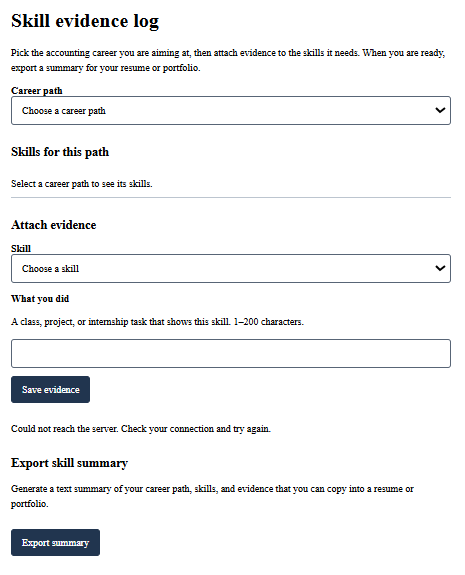
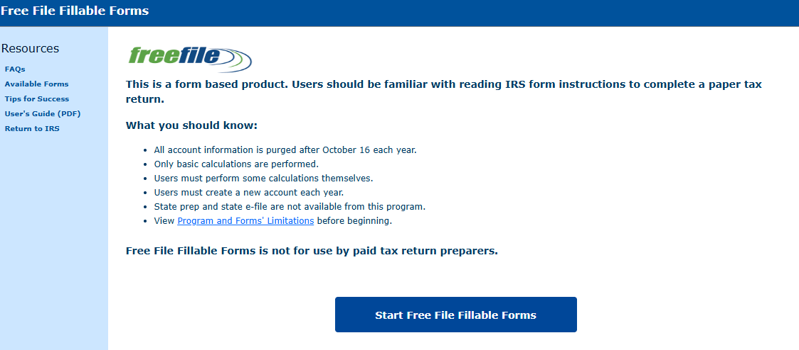
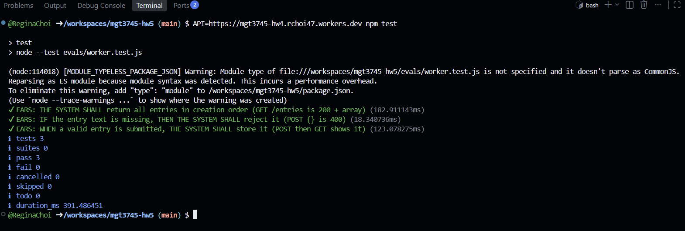

# docs

The See It Work evidence is provided as a screenshot rather than a GIF. The admired interface has a screenshot. A separate screenshot is not provided for the resented example because the example is based on my experience rather than a reproduced screenshot.

see-it-work-screenshot 

STYLE.md-Screenshot 

npm-test 